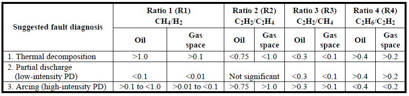
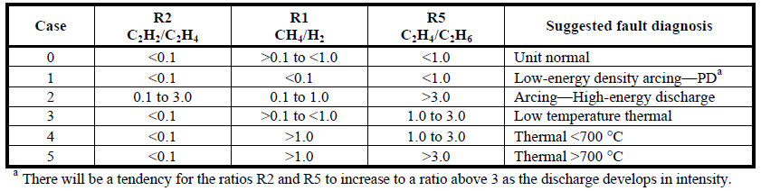
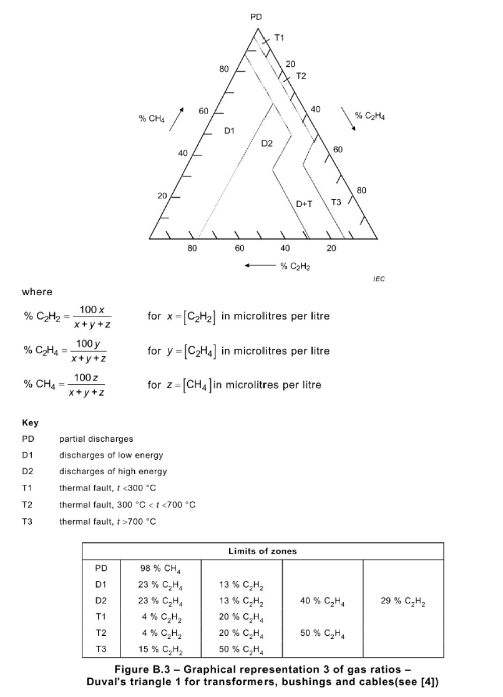
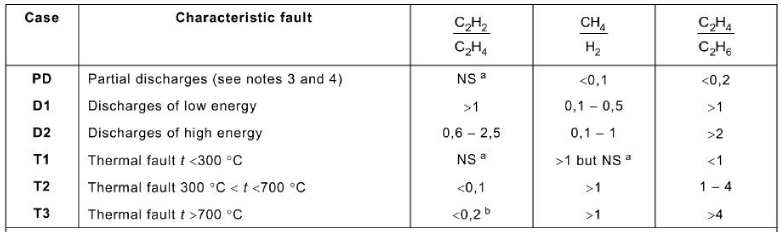

# Appendix 
## Dictionary of Literary Terms: 
**(1)	Data Recovery:** At present, some online DGA monitoring equipment are developed and installed in few large capacity transformers, however, most of operating companies conventionally measures DGA data offline periodically in person. Due to human error of measurement and volatility of the measured gas, a offline measurement error occurs quite often, which causes misdiagnosis and leads to perform an invalid action plan. To prevent these problems, GuardiOne® Transformer provides error compensation algorithm for data recovery upon six gases (H2, CH4, C2H2, C2H4, C2H6, CO) using statistical data imputation method. The algorithm is only activated at least when there are four continuous measurement data per transformer. If more than four DGA data exists and the data anomalies are found in the database, all six gases data used for AI calculations are pre-processed by data imputation. 

**(2)	Oil Filtration Evaluation Criteria:** For instantaneous transformer condition improvement, transformer has a regular or temporary oil filtration maintenance process. However, if the filtering date is not recorded, GuardiOne® Transformer activates its self-evaluation criteria algorithm to determine if the oil has been filtered. GuardiOne® Transformer has different prognosis models to use depending on whether oil filtration has occurred. Therefore, if it is determined that oil filtration has occurred, the prognosis model is tuned.

**(3)	Fault Detection/Isolation/Prognosis based on AI:** GuardiOne® Transformer is an innovative software using deep learning method detecting the health status (normal/warning/critical/fault), and predicting the future status (normal/warning/critical/fault) based on learning the history data. Fault prognosis algorithm is similar to data recovery algorithm driving condition which requests at least four continuous DGA data to prognosis the next status. In addition, when the transformer is detected as a fault by AI, prognosis algorithm is inactive. GuardiOne® Transformer also provides a fault component isolation method. Since GuardiOne® Transformer has learned the fault data for the four main components (winding/core/OLTC/bushing) with the most generated faults, it presents the component with the highest probability of faults among the four components when it happens to be a faulty status.

**(4)	Similarity Analysis:** The similarity analysis is calculated for using the feature values (Variables indicating the status of transformer based on Industrial AI which provided only by GuardiOne® Transformer) extracted from all DGA data for each transformer GuardiOne® Transformer has. According to the time flow of each transformer, four continuous feature values are set as a bundle, and the difference between the feature values of the latest four DGA of the targeted transformer and the feature values set as a bundle is calculated. Then user can find the transformer with the most similar data bundle to the latest four DGA statuss of the targeted transformer. Therefore, in order to run the similarity algorithm as in the above method, transformer’s data which used for calculating the data must have at least four serial DGA values in the database, and the targeted transformer must have at least four DGA values as well. GuardiOne® Transformer provides visual information (four continuous and next one) on the features, DGA trend, status trend and similarity of the most similar bundle of transformers as a reference for user check the future status of transformer. 

**(5)	IEEE Std C57.104TM-2008 - Dissolved key gas concentration limits**: A four-level criterion of ‘IEEE Std C57.104TM-2008 - IEEE Guide for the Interpretation of Gases Generated in Oil-Immersed Transformers’ is provided to classify risks to transformers. The content includes threshold of the dissolved gas concentrations for the individual gases and TDCG from Condition 1 to Condition 4. The condition for a target transformer is determined by finding the highest level for individual gases or the TDCG in Table 1. For detailed technical description, please refer to ‘IEEE Std C57.104TM-2008 - IEEE Guide for the Interpretation of Gases Generated in Oil-Immersed Transformers’.

Table 1. Dissolved key gas concentration limits
  

**(6)	IEEE Std C57.104TM-2008 – Doernenburg Ratios:** Doernenburg ratios is an evaluation of possible fault type method provided in ‘IEEE Std C57.104TM-2008 - IEEE Guide for the Interpretation of Gases Generated in Oil-Immersed Transformers’ for diagnosis of fault mode. As shown in Table 2, R1 (Ratio1, CH4/H2), R2 (Ratio2, C2H2/C2H4), R3 (Ratio3, C2H2/CH4), R4 (Ratio4, C2H6/C2H2) are compared to limiting values, suggests corresponding fault mode. For detailed technical description, please refer to ‘IEEE Std C57.104TM-2008 - IEEE Guide for the Interpretation of Gases Generated in Oil-Immersed Transformers’.

Table 2. Doernenburg Ratios
  

**(7)	IEEE Std C57.104TM-2008 – Rogers Ratios:** The Roger ratios method follows the same general procedures as the Doernenburg method, except only three ratios (R1 C2H2/C2H4, R2 CH4/H2, R5 C2H4/C2H6). But, as with the Doernenburg method, the Rogers ratios can give ratios that do not fit into the diagnostic codes. Therefore, other analytical methods such as Duval Triangle 1 and Basic Gas Ratio should be considered for diagnosis of fault mode. Table 3 gives the values for the three key gas ratios corresponding to suggested diagnoses. For detailed technical description, please refer to ‘IEEE Std C57.104TM-2008 - IEEE Guide for the Interpretation of Gases Generated in Oil-Immersed Transformers’.

Table 3. Rogers Ratios
  

**(8)	IEC 60599:2015 - Duval Triangle 1:** Duval Triangle 1 is a fault identification method provided in ‘IEC 60599 – Mineral oil-filed electrical equipment in service – Guidance on the interpretation of dissolved and free gases analysis’. As shown in Figure1, the triangle is divided by six particular fault mode zones, and depending on the three gas ratios values (R1 C2H2/C2H2+C2H4+CH4, R2 C2H4/C2H2+C2H4+CH4, R3 CH4/C2H2+C2H4+CH4), it indicates the corresponding fault mode. For detailed technical description, please refer to ‘IEC 60599 – Mineral oil-filed electrical equipment in service – Guidance on the interpretation of dissolved and free gases analysis’.

Figure 1. Duval Triangle 1
  

**(9)	IEC 60599:2015 - Basic Gas Ratios:** Except Rogers Ratios methods provided in IEEE Std C57.104TM-2008, IEC 60599 also guides fault identification method using different three gas ratios (R1 C2H2/C2H4, R2 CH4/H2, R3 C2H4/C2H6). Each of six board classes of faults leads to characteristic pattern of hydrocarbon gas composition, which is described in Table 4. For detailed technical description, please refer to ‘IEC 60599 – Mineral oil-filed electrical equipment in service – Guidance on the interpretation of dissolved and free gases analysis’.

Table 4. Basic Gas Ratios
  

NSa = Non-significant whatever the value