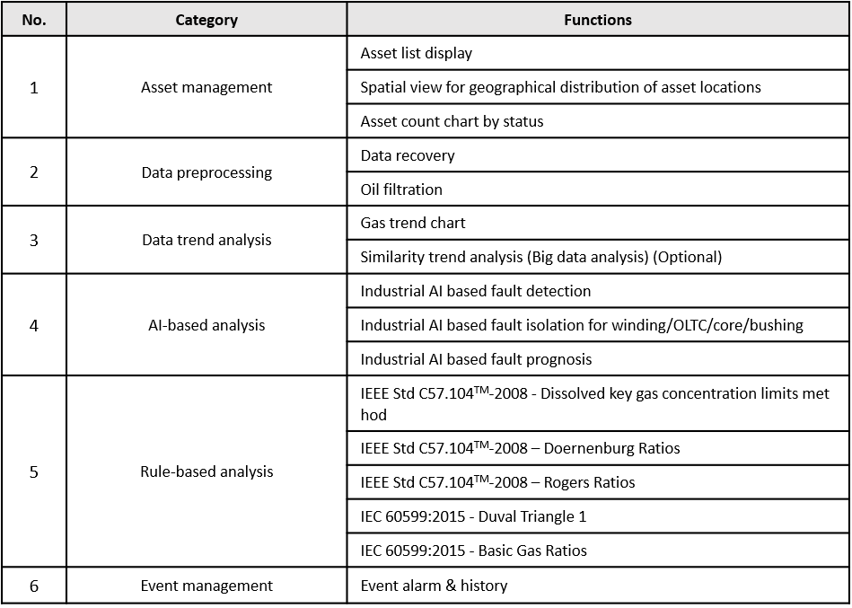

# Product Introduction  

## Target Transformer and Data information
**Oil Immersed Type Transformer**

GuardiOne® Transformer is developed to assist in operation and maintenance planning of oil immersed type transformer, also called oil filled/insulated transformer. Oil immersed transformer is one of the most common and important type of transformers found anywhere. The reason for the universal use of this type transformer is that oil not only provides insulation and cooling but also helps extinguish arcs. Therefore, the primary function of oil is keeping the transformer stable condition at high temperature and excellent electrical insulation. 

-------------

**Dissolved Gas Analysis (DGA)**  
GuardiOne® Transformer provides solutions for transformer health management based on Dissolved Gas Analysis(DGA), which is common method for transformer fault detection. Due to the thermal and electrical stresses that occur during the insulation of operating transformers, decomposition of paper or/and oil occurs, generating gases that are dissolved in the oil and reduce its dielectric strength. Gases generated through oil decomposition include hydrogen (H2), methane (CH4), acetylene(C2H2), ethylene (C2H4), and ethane (C2H6). On the other hand, carbon monoxide (CO) and carbon dioxide (CO2) are generated as a result of paper decomposition. Faults such as overheating, partial discharge, and sustained arcing produce a range of gases, the concentrations of which can be used to identify faults and estimate their severity. 

##Key Functions of GuardiOne® Transformer

※ Detailed description of methods are provided in ‘Appendix – Dictionary of Literary Terms’  
※ DGA similarity analysis function is extended when Cloud service is effective through financial registration on big data-based analysis functions. The on-premise environment will not be able to approach Cloud services.

