# User Guide

## Asset Management
The asset management platform provides all transformers’ information as table chart. You can check the list of transformers efficiently and search transformers with specific conditions. 

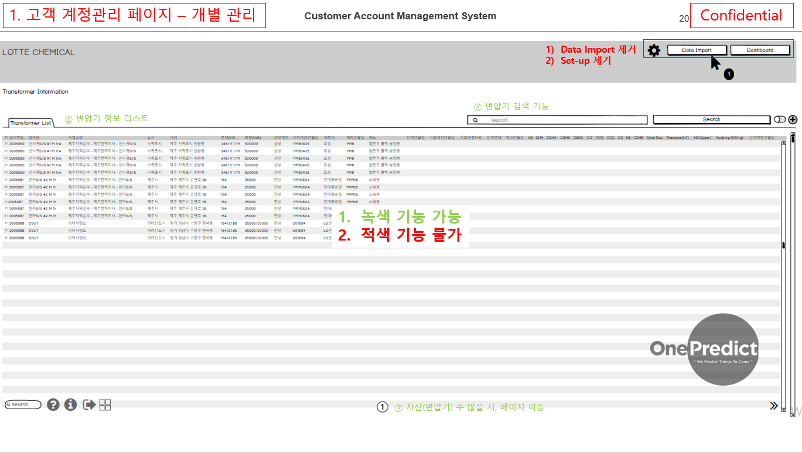

**(1)	Transformer Information List: The contents of the table includes the following information for integrated management:** serial number, transformer tag, substation name, country, city, street, voltage(kV), capacity(kVA), one/three-phase, operating date, manufacturer, manufacturing date, and application.  
※ The unit for gas in this software is ppm.  
※ All dates in this software in yy/mm format.  

**(2)	Search Box:** You can search the transformers by typing a specific information on the ‘Search Box’. 

## Power Substation Monitoring
This function provides summarized status of the selected transformers regionally in an aspect of spatial view, alarm rate, status diagram, and latest events.
 
 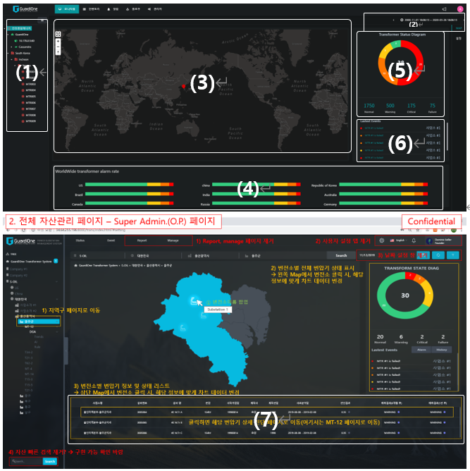
     
**(1)	Asset Tree Structure:** A tree-like panel represents the transformers in a hierarchical structure and analysis methods of each transformer in the database. You can click a label to expand a node and reveal its hierarchy. If you select the specific country/city/street of transformer in the left tree-like panel, right map panel and other widget contents are changed to suit for the information in the selected area. When a specific transformer model is selected, the details of health information about the selected transformation are expanded.  

**(2)	Time Setting:** The user can examine information through time zone using the time setting function. The time setting function can be set throughout the whole timeline. This means when the time set is applied, all pages will follow the set the user have made. The time settings are applicable in  dates also.  Followings are the instructions of how the time settings are enabled.  

**(3)	Spatial View:** The panel shows the geographical distribution of transformer locations. As a default first display, a world map is provided. The user can zoom in and out from the world and specific city map by mouse wheel button or click  , 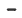 icon. The user also can click  icon to maximize it to full-screen and click  icon to reset map to north direction. The area with a red point is the country or region where the user has transformers.  

**(4)	Alarm Rate by Health Status:** The panel shows the percentage of transformer at each health status by color-bar graph.  
※ Green: (Normal status) / Yellow : (Warning status) / Orange : (Critical status) / Red: (Fault status)    

**(5)	Status Diagram:** The donut chart displays the number of transformers at each health status in the selected area. When you put the cursor on the chart, a pop-up displays the percentage of transformers in the corresponding status. The number centered on the donut chart means the total number of transformers in the selected area. In addition, the number of transformers at each health status is also displayed below the chart.  

**(6)	Latest Event:** The panel updates the diagnosis result periodically. Briefly provides transformer tag, health status diagnosed by AI, and diagnosis date.  

**(7)	Event History:** The table shows transformers’ information in the selected region. The content includes substation name, serial number, transformer tag, voltage(kV), operating date, manufacturer, manufacturing date, DGA sampling date, and diagnosis/prognosis results.  Clicking specific transformer tag in the table switches the dashboard into the description page about the corresponding transformer.  

## Power Transformer Monitoring
This screen covers the detailed information of the targeted transformer  including trend analysis, industrial AI-based diagnosis and prognosis results, rule-based diagnosis results and  summarized results from core features. 

---

### Summary Information
This function provides the latest analysis results of the transformer in brief.

 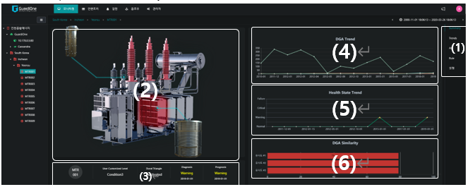
 
**(1)	Function Tree:** When enter the individual transformer page, the function tree is displayed at the right panel. The panel includes a summary of the transformer information, AI, Rule related graphs and the setting tab for checking detailed information of the target transformer.   

**(2)	Fault Isolation:** The panel shows fault components in 3D visual image. When the fault is detected on the transformer by Industrial AI-based diagnosis, the fault component is highlighted in the 3D model. 
 
**(3)	Comprehensive Predictive Diagnosis Result:** The panel summarizes the predictive diagnosis results once the measured data are loaded. It provides the latest diagnosis results in reference to IEEE Std C57.104TM-2008 ‘Dissolved key gas concentration limits’ diagnostics standard. The fault mode evaluated by IEC 60599:2015 - Duval Triangle 1 method is also displayed, but it is inactivated in case there is no fault. In addition, the results of diagnosis and prognosis are displayed based on industrial-AI methods.  

**(4)	DGA Trend**: The panel displays the concentration trends of the main six gases (H2, CH4, C2H2, C2H4, C2H6, CO). If target transformer data has at least four continuous data and it is evaluated that the data is in error, the data provided in this dashboard is the calibrated data. When you put the cursor on a data point, the values of six gases are indicated by a pop-up window.   

**(5)	Health State Trend:** The panel displays the entire health status (normal, warning, critical, fault) trend of the transformer, which allows users to understand the overall changes in transformer status. When you put the cursor on a data point, the detailed health status is indicated by a pop-up window.   

**(6)	DGA Similarity (Optional):** Based on big data analysis, the panel shows the top three most similar transformers and the corresponding similarity. Users can check the status of the most similar transformers as a reference for the future status of the targeted transformer identification. The specific details about DGA similarity are illustrated in the ‘Trend - Similarity Trend’ page.  

--------
### Trend Analysis
 This function provides two main methods which is featured on trend analysis. One is gas trend analysis, descripting the transformer’s status. The other is a DGA-based similarity trend analysis (optional), which also informs the status with comparing historical data with the most similar trends to the targeted transformer. Quick and immediate actions can be made through monitoring the status variation.

--------
###Gas Trend Analysis
This function offers three types of plots that represents gas characteristics intuitively.   
※ All DGA data provided on this dashboard are actual values. It is not a calibrated data value.

 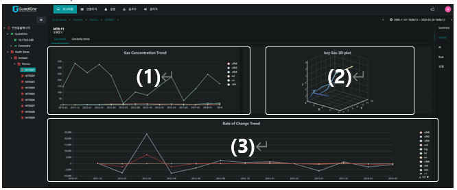

**(1)	Gas Concentration Trend:** The panel visually provides the whole gas DGA data throughout the time. The plotted gases are H2, CH4, C2H2, C2H4, C2H6, CO, CO2, TDCG, C3H8, O2, N2, etc. The users can hide a gas trend by clicking the legend of the gas. When you put the cursor on a data point, the values of all selected gases are indicated by a pop-up window.

**(2)	Key Gas Trend:** In order to make it easier for the users to understand the correlation between the three key hydrocarbon gases (CH4, C2H4, C2H6), the panel shows 3D trend plot of the three gases over time. When you put the cursor on a data point, the values of three gases are indicated by a pop-up window.

**(3)	Rate of Change Trend:** The trend provides the rate of change of each gas between two measuring points. The value is calculated by dividing the gas difference between two measuring points by month difference between two measured dates. The users can hide a rate change trend of specific gas trend by clicking the legend of the gas. When you put the cursor on a data point, the rate change of all selected gases are indicated by a pop-up window.

---

### Similarity Trend Analysis (Optional)
This function provides users with meaningful insights for predictive maintenance of transformers by presenting the most similar transformers. 
 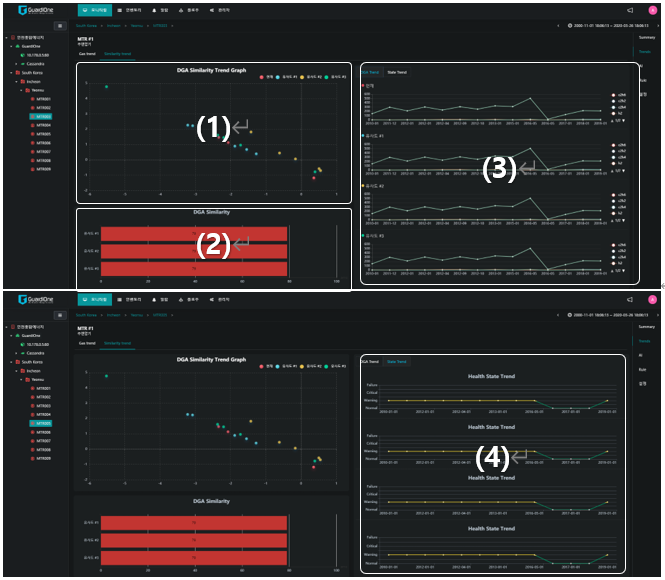
 
**(1)	DGA Similarity Trend:** This figure are results of the health feature space. It showsthe trend of the targeted transformer in features values comparing with three transformers that have  the most similar status .  The values are variable in representing the status of the transformer. Industrial AI are applied to calculate the results. It is composed of two values and represents the x & y axis in the figure. The DGA-based similarity analysis technique aims and finds the most similar transformer trend through four continuous feature values comparisons, so this figure provides the four feature values of the targeted transformer and the three transformers with the highest similarity. In addition, the fifth feature value of the three transformers with the highest similarity is also provided at the same time, thereby providing a reference value for understanding the future featured value of the targeted transformer. 
※ Red : (Targeted transformer) / Blue : (First similar transformer) / Yellow : (Second similar transformer) /    
Green : (Third similar transformer) 

**(2)	DGA Similarity Chart:** The panel shows the top three most similar transformer tags and the corresponding similarity.

**(3)	DGA Trend:** Click the ‘DGA Trend’ tab, the panel displays the main six gases of DGA (H2, CH4, C2H2, C2H4, C2H6, CO) trend of three similar transformers and the targeted one. In addition, the highlighted part is the most similar gas value of three similar transformers comparing to the latest four measuring data of the targeted transformer. Therefore, the users can check the 5th set of data of three similar transformers as a reference for the targeted transformer. When you put the cursor on a point, a pop-up displays the values of six gases.

**(4)	Status Trend:** By clicking the ‘Status Trend’ tab, the panel displays the status trend of three similar transformers and the targeted one’s status. Similar to the DGA Trend, the highlighted part is the most similar interval status, compared to the targeted transformer. In the same way, the users can check the 5th set of state of three similar transformers. This analytic method helps for a better understanding of the targeted transformer’s next health state. When you put the cursor on a point, a pop-up displays the very status at the moment.

---

### Industrial AI-based Diagnosis and Prognosis

This function provides overall diagnostic and prognostic results based on industrial AI methods. The dashboard contains health feature space, health state trend, the health status at present and future, and fault isolation.   

 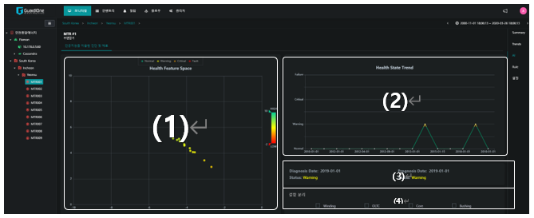
 
**(1)	Health Feature Space:** Health feature space is composed of two key health features derived from deep learning. This space is a diagnostic space which shows the entire health feature trend over time. The right-bottom direction of health features means the change in transformer status from normal(green) to fault(red). Users can trace the movement of feature points to check the condition of the transformers. The black line in the plot indicates the threshold between critical and fault status. If featured points are colored in orange or close to the threshold, it is recommended to check the value change carefully for transformer protection. Even if the movement of the dots are slight, it may cause a huge damage to the transformer only with a small abnormal operation. 

**(2)	Health State Trend:** The panel provides a historical change of health status. And it also presents the predicted status after a year. You can plan the maintenance action by referring to this. When you put the cursor on a data point, the health status at that moment is indicated by a pop-up window.
*Exception: If the fault is detected, we do not draw a prognostic result. 

**(3)	Diagnosis and Prognosis Result:** The panel shows the results of diagnosis and prognosis with date.

**(4)	Fault Isolation:** The panel tells you which of four components (Winding, OLTC, Core, and Bushing) is faulty.

---

### Rule - Dissolved key gas concentration limits

This function provides the description of the diagnostic analysis according to the rule-based method ‘IEEE Std C57.104TM-2008 - dissolved key gas concentration limits’.

 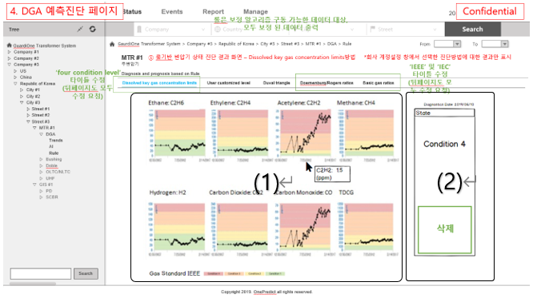
 
**(1)	Dissolved Key Gas Concentration Limits Trend:** The panel shows trends of each gas and the whole gas in charts (H2, CH4, C2H2, C2H4, C2H6, CO, CO2, TDCG).  The thresholds of the gas and TDCG are also provided to be easily reviewed by which status the targeted gas is invlolved. In the charts, the very gas values are displayed as you hover over different charts.
※ Green : (Condition 1) / Yellow : (Condition 2) / Orange : (Condition 3) / Red : (Condition 4)

**(2)	Dissolved Key Gas Concentration Limits Result:** The right panel contains the latest diagnostics results of the ‘Dissolved Key Gas Concentration Limits’ detection method.

---

### Rule - Duval Triangle 1

This function provides the description of the diagnostic analysis according to the rule-based method ‘IEC 60599:2015 - Duval Triangle 1’ fault identification method’.  

 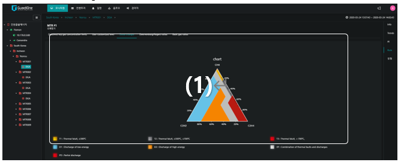
 
**(1)	Duval Triangle 1:** The main panel contains fault modes evaluated by the ‘Duval Triangle 1’ method. The method is active when the transformer is in fault status by means of AI techniques. Concentrations (ppm) of CH4, C2H4, and C2H2 are shown as percentages of thetotal (CH4+C2H4+C2H2) and points are (%CH4, %C2H4, %C2H2) on the triangular coordinate system.  The triangle chartis fenced off into different fault zones. The designated fault type decides the status according to the point location and indicates what kind of gas concentration it is. The small square boxes below the triangle corresponds to the fault modes (in color). The square boxes have text tags right next to it and when the faults are detected the square boxes blinks to be notified for the users.

---

### Rule - Doernenburg and Rogers Ratios

This function provides the description of the diagnostic analysis according to the rule-based method ‘IEEE Std C57.104TM-2008 - Doernenburg/Rogers Ratios fault identification method’. 
 
 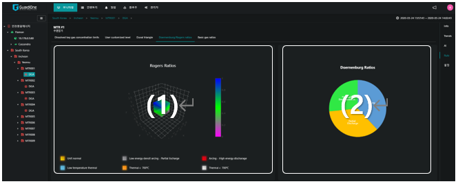
 
**(1)	Rogers Ratios:** The left panel contains Rogers Ratios in which the concentrations of gases in a 3-axis cube graph (each axis is C2H2/C2H4, CH4/H2, C2H4/C2H6). The small square boxes below the cube represents the fault mode. The value points location shows the specific fault condition. GuardiOne® Transformer provides the latest fault modes. The square boxes have text tags right next to it and when the faults are detected the square boxes blinks to be notified for the user. This method is active when the transformer is in fault status (only when detected to be faulty) by AI techniques.

**(2)	Doernenburg Ratios:** The right panel contains Doernenburg Ratios in four distinct gas concentrations (the specific ratios are CH4/H2, C2H2/C2H4, C2H2/CH4, C2H6/C2H2). The latest fault mode is highlighted in the graph. This method is also active when the transformer in fault status (only when detected to be faulty) by AI techniques.

---

### Rule - Basic Gas Ratios
This function provides the description of the diagnostic analysis according to the rule-based method ‘IEC 60599:2015 – Basic Gas Ratios fault identification method’.
 
 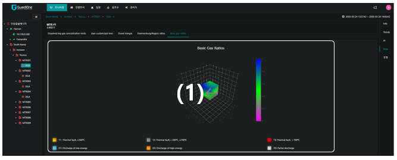
 
**(1)	Basic Gas Ratios:** The main panel contains the concentrations of gases in a 3-axis cube graph (each axis is C2H4/C2H6, CH4/H2, C2H2/C2H4) and the area of six different types of fault modes. The small square boxes below the cube represents the fault modes, and the latest fault mode is pointed at the corresponding fault mode area. The method of Basic Gas Ratios is similar to Roger Ratios. However, the gas ratios used for analysis and the corresponding fault modes are different from Roger Ratios. This method is operated only when the AI algorithm diagnoses a fault.

---

### Event History 
This function offers a clear overview of the latest status upon the entire transformers analyzed by GuardiOne® Transformer.

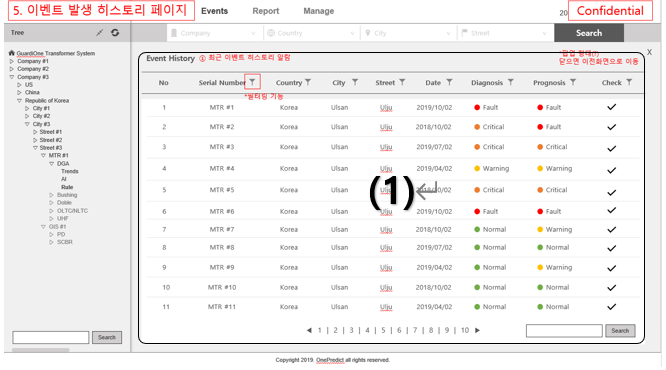

**(1)	Event History:** The main table lists up all transformers’ information briefly and the periodic status diagnosed by GuardiOne® Transformer. The content includes basic information such as serial number, location information (Country – City – Substation), measurement date, latest status and the status after a year. If the transformer is in fault status on the diagnosis procedure, the prognosis algorithm cannot be operated, so concluding the results are not possible. Click the page number for checking the other transformers’ status. information.